# O11y Infographics by Gopal Rao

> **Single-file, self-contained observability infographics** built on the Grafana
> **LGTM+P** stack (Loki · Grafana · Tempo · Mimir · Pyroscope).

This repo collects visual explainers on where observability, automation, and AI
actually meet in modern operations. Each infographic is one portable HTML file —
no build step, no framework, no runtime dependencies.

| # | Infographic | File | Theme |
| --- | --- | --- | --- |
| 1 | **When to *NOT* Use an AI Agent** | [`index.html`](index.html) | O11y automation decision framework |
| 2 | **O11y vs AIOps? Not a Battle. Better Together.** | [`o11y-vs-aiops.html`](o11y-vs-aiops.html) | O11y ↔ AIOps comparison + bridge |

---

## 1. O11y vs AIOps? Not a Battle. Better Together.

**File:** [`o11y-vs-aiops.html`](o11y-vs-aiops.html)

A comparison infographic that reframes the O11y-vs-AIOps question. They aren't
competitors — **O11y finds the signal, AIOps supplies the intelligence**, and a
bridge between them delivers *Intelligent Operations*: Observe → Correlate → Act.
It closes with a 7-step future-architecture pipeline showing how the two combine
end to end.

### Hero — O11y vs AIOps, side by side
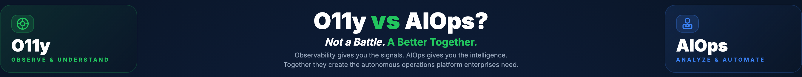

### Best For — where each approach shines, bridged in the middle
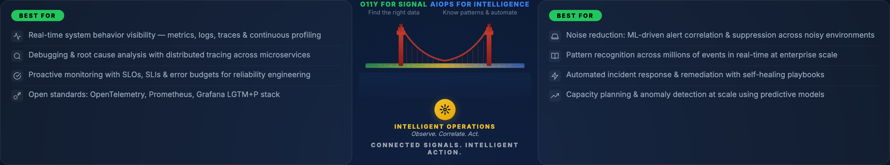

### The Bridge — Intelligent Operations: Observe · Correlate · Act
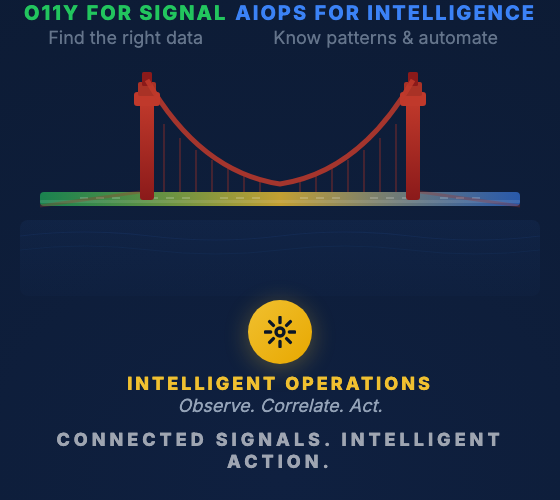

### Strengths — O11y and AIOps strengths around the shared pipeline
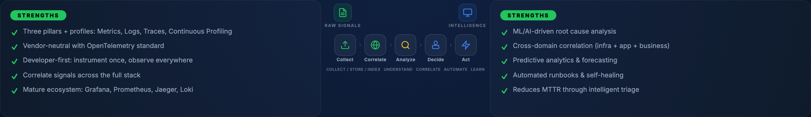

### The Pipeline — Collect → Correlate → Analyze → Decide → Act
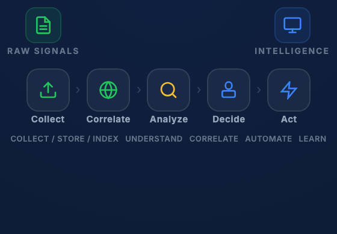

### The Future Architecture — 7-Step Pipeline
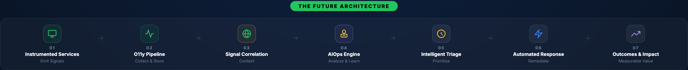

### Closing
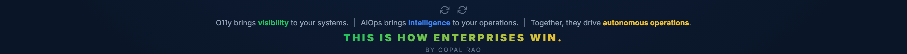

> A full-page render is available at [`screenshots/vs-00-full-page.png`](screenshots/vs-00-full-page.png).

---

## 2. When to *NOT* Use an AI Agent in Observability

**File:** [`index.html`](index.html)

A practitioner's decision framework for the LGTM+P stack that answers a question
most "AI for Ops" content skips: **when should you *not* reach for an autonomous
agent?**

In a world rushing to wrap every task in an LLM agent, this poster argues the
opposite discipline — roughly **60%** of observability work is deterministic
scripting, **30%** is orchestrated workflows, and only **~10%** genuinely benefits
from autonomous agents. It gives you the criteria, tests, and anti-patterns to tell
them apart before you over-engineer.

### Header


### The Decision Matrix — 7 criteria × 3 automation tiers
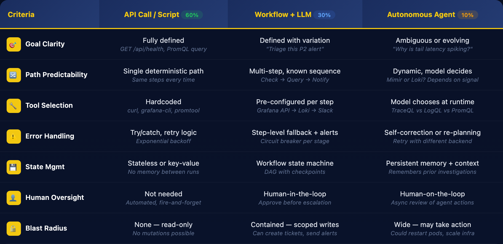

### O11y Signal Decision Flow — Metrics → Logs → Traces → Profiles → Correlate


### Real-World Use Case Mapping — the 60 / 30 / 10 split
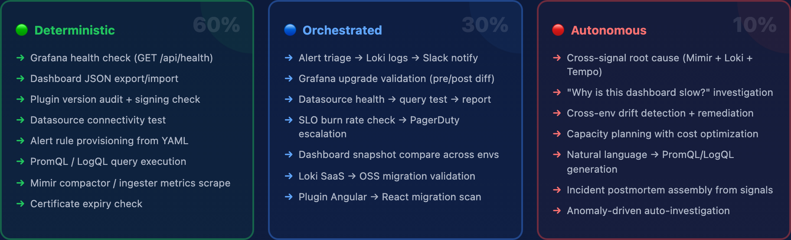

### The Over-Engineering Test — 7 questions
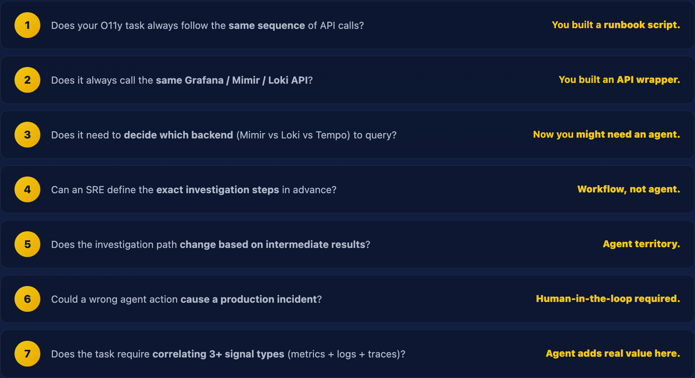

### The Automation Spectrum
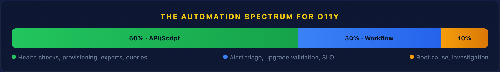

### O11y Agent Anti-Patterns
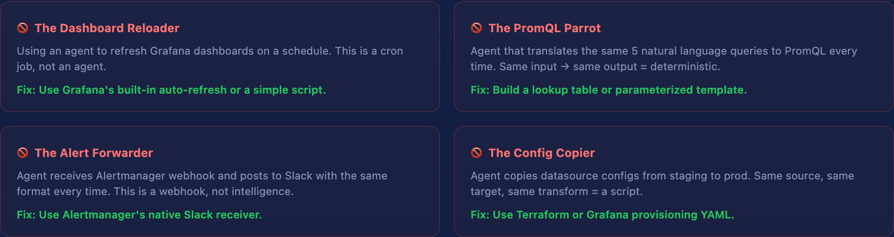

### Quick Decision Tree
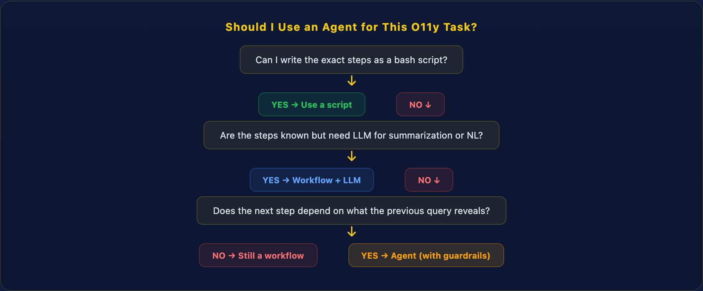

### Cost & Complexity Reality
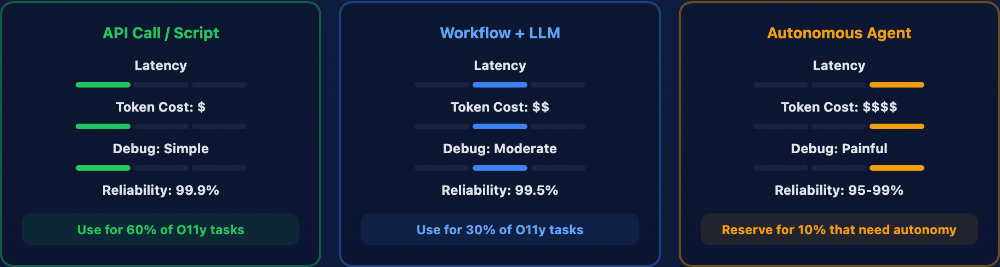

> A full-page render is available at [`screenshots/00-full-page.png`](screenshots/00-full-page.png).

#### What's Inside

| Section | What it covers |
| --- | --- |
| **The Decision Matrix** | 7 criteria (Goal Clarity, Path Predictability, Tool Selection, Error Handling, State Mgmt, Human Oversight, Blast Radius) mapped across API/Script → Workflow+LLM → Autonomous Agent. |
| **O11y Signal Decision Flow** | Metrics → Logs → Traces → Profiles → Correlate. One signal = script; chaining signals = workflow; *deciding which signal to query* = agent. |
| **Real-World Use Case Mapping** | Concrete Grafana/Mimir/Loki/Tempo/Pyroscope tasks bucketed into the 60% Deterministic / 30% Orchestrated / 10% Autonomous split. |
| **The Over-Engineering Test** | 7 questions that tell you whether you actually built a runbook script, an API wrapper, a workflow — or a real agent. |
| **The Automation Spectrum** | A visual 60/30/10 bar of where O11y automation effort should land. |
| **O11y Agent Anti-Patterns** | Four traps — the Dashboard Reloader, PromQL Parrot, Alert Forwarder, Config Copier — each with the simpler fix. |
| **Quick Decision Tree** | A three-question flow: bash script? → workflow + LLM? → agent (with guardrails)? |
| **Cost & Complexity Reality** | Latency, token cost, debuggability, and reliability compared across the three tiers. |

---

## How to View

No build step, no dependencies, no server required:

```bash
open o11y-vs-aiops.html   # macOS — the O11y vs AIOps comparison
open index.html           # macOS — the "When to NOT Use an AI Agent" framework
# or just double-click either file in your file browser
```

Everything — layout, styling, and content — lives inside each single HTML file.

---

## Tech Stack

- **Pure HTML + CSS** — no frameworks, no build tooling, no runtime dependencies.
- **Inline `<style>`** — CSS grid/flexbox layout, gradient backgrounds, inline SVG
  illustrations (the suspension-bridge graphic), fully self-contained.
- **Dark navy gradient theme** with emerald/teal and gold accents, matched to the
  observability brand.

Screenshots in this README are generated with [Playwright](https://playwright.dev/)
at 2× device scale for retina-sharp section captures:

- `shoot.js` → `index.html` screenshots (`01-…` through `09-…`)
- `shoot-vs.js` → `o11y-vs-aiops.html` screenshots (`vs-…`)

### Regenerating the screenshots

```bash
npm install playwright
npx playwright install chromium
node shoot.js        # writes index.html PNGs into screenshots/
node shoot-vs.js     # writes o11y-vs-aiops.html PNGs into screenshots/
```

---

## Attribution

Created by **Gopal Rao**, built on the Grafana **LGTM+P** stack
(Loki · Grafana · Tempo · Mimir · Pyroscope).

> *"The best O11y architects don't ask 'where can I use agents?' — they ask
> 'where is deterministic automation no longer sufficient?' — and they know that
> O11y and AIOps aren't a battle. They're better together."*
